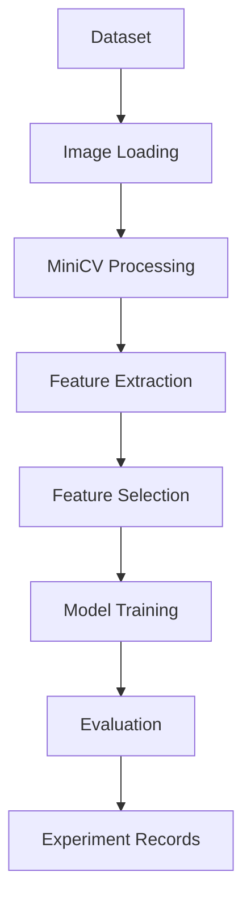

# New Vision

> A lightweight computer vision framework built from scratch in Python, combining classical image processing, feature engineering, and machine learning into a modular educational and research-oriented toolkit.


## Table of Contents
- Overview
- Motivation
- Features
- Repository Structure
- Architecture
- Installation
- Usage
- MiniCV
- Machine Learning Models
- Feature Engineering
- Experiments
- Results
- Roadmap
- Contributing
- Citation
- License

---

# Overview

New Vision is a modular computer vision framework developed to explore and implement the complete image-processing and machine-learning pipeline from first principles. Instead of relying exclusively on high-level libraries, the project includes custom implementations of image processing routines, feature engineering utilities, machine learning models, and experiment management tools.

The repository is intended for educational use, experimentation, and as a foundation for future computer vision research.

# Motivation

The project was created to understand every stage of a vision pipeline:

- Image preprocessing
- Classical computer vision
- Feature extraction
- Feature selection
- Machine learning
- Deep learning
- Evaluation
- Experiment tracking

---

# Features

- Custom MiniCV image processing library
- Classical image processing utilities
- Feature extraction pipeline
- MRMR feature selection
- CNN implementation
- Softmax Regression
- K-Nearest Neighbors
- Modular training utilities
- Evaluation metrics
- Experiment logging
- Visualization utilities

# Repository Structure

```text
new_vision/
├── minicv/
├── models/
├── feature_ex/
├── feature_selection/
├── trainer/
├── utils/
├── notebooks/
├── experiment_records/
├── tests_summary/
└── report/
```

## Folder Descriptions

| Folder | Description |
|--------|-------------|
| minicv | Custom computer vision library |
| models | ML and CNN implementations |
| feature_ex | Feature extraction |
| feature_selection | Feature selection algorithms |
| trainer | Training pipeline |
| utils | Helper utilities |
| notebooks | Demonstrations |
| experiment_records | Training logs |
| tests_summary | Evaluation summaries |
| report | Project documentation |

# Architecture



# Installation

```bash
git clone https://github.com/jaegerattacks-lgtm/new_vision.git
cd new_vision

python -m venv .venv

# Linux/macOS
source .venv/bin/activate

# Windows
.venv\Scripts\activate

pip install -r requirements.txt
```

> Python 3.12 


# Train & Evaluate 

```bash
python demo.ipynb
```


 

# MiniCV

MiniCV is a lightweight image-processing module implemented for this project.

Capabilities include:

- Image loading
- Filtering
- Geometric transformations
- Drawing utilities
- Feature extraction helpers
- Histogram operations
- Edge detection
- Thresholding

# Machine Learning Models

| Model | Purpose |
|------|---------|
| Softmax Regression | Baseline multiclass classifier |
| KNN | Distance-based classifier |
| CNN | Deep image classifier |
| Paper CNN | Research-oriented implementation |

# Feature Engineering

Pipeline:

```text
Images
 ↓
Preprocessing
 ↓
Feature Extraction
 ↓
MRMR Feature Selection
 ↓
Model Training
 ↓
Evaluation
```

# Dataset

> The used dataset is : Intel Image classification dataset

> The Intel Image Classification dataset contains approximately 25,000 images of size 150x150 pixels, evenly distributed across 6 classes of natural and man-made scenes. 

| Class Label | Category | Description |
| :--- | :--- | :--- |
| **0** | **Buildings** | Man-made structures and urban architecture |
| **1** | **Forest** | Dense tree coverage and woodland areas |
| **2** | **Glacier** | Ice formations and snowy landscapes |
| **3** | **Mountain** | Rocky peaks and high-altitude terrain |
| **4** | **Sea** | Ocean views and large water bodies |
| **5** | **Street** | Roads, highways, and urban pathways | 

>The dataset is organized into three distinct folders for different stages of the machine learning pipeline:

>Training Set (seg_train): Contains approximately 14,000 images used for model training. 
>Test Set (seg_test): Contains approximately 3,000 images used for validation and testing. 
>Prediction Set (seg_pred): Contains approximately 7,000 images (unlabeled) used for final predictions and challenges. 
>The images are generally evenly distributed across the six categories within the training and test sets, making it a balanced dataset for multi-class classification tasks. The dataset was originally released by Intel for a challenge on Analytics Vidhya and is widely hosted on platforms like Kaggle and Hugging Face. 
 
> Preprocessing : Through the minicv library, having functions for i/o images and image augementation.

# Experiments

Large experiment artifacts are stored externally due to GitHub size recommendations.

Google Drive:

https://drive.google.com/drive/folders/1uL3-vD1Lxrmeyqh8Nby6p1VnhgXhRlIg 

Contents include:

- Experiment records
- Test summaries
- Feature cache
- Training logs
- Generated figures
- Model checkpoints 

# Results

| Model | Accuracy | Precision | Recall | F1 |
|------|---------:|----------:|-------:|---:|
| Softmax | 0.38 | 0.75 | 0.37 | 0.22 |
| KNN | 0.43 | 0.33 | 0.45 | 0.42 |
| CNN | 0.56 | 0.66 | 0.70 | 0.54 |

 

# Roadmap

- [ ] Add Vision Transformer support
- [ ] GPU acceleration
- [ ] Hyperparameter search
- [ ] ONNX export
- [ ] Real-time inference
- [ ] Object detection
- [ ] Semantic segmentation

# Contributing

Contributions are welcome through issues and pull requests.

# Citation

```bibtex
@misc{newvision2026,
  title={New Vision},
  authors={Suhaila khaled and Sarah Nizar},
  year={2026},
  url={https://github.com/jaegerattacks-lgtm/new_vision}
}
```

# License

© 2026 Suhaila Khaled, Sarah Nizar. All Rights Reserved.
This project is licensed under the MIT License.

---

## Acknowledgements

This project builds upon concepts commonly found in:

- OpenCV
- NumPy
- Matplotlib
- Scikit-learn
- Deep learning research literature


### Module Notes 1

> TODO: Document module functionality and implementation details.


### Module Notes 2

> TODO: Document module functionality and implementation details.


### Module Notes 3

> TODO: Document module functionality and implementation details.


### Module Notes 4

> TODO: Document module functionality and implementation details.


### Module Notes 5

> TODO: Document module functionality and implementation details.


### Module Notes 6

> TODO: Document module functionality and implementation details.


### Module Notes 7

> TODO: Document module functionality and implementation details.


### Module Notes 8

> TODO: Document module functionality and implementation details.


### Module Notes 9

> TODO: Document module functionality and implementation details.


### Module Notes 10

> TODO: Document module functionality and implementation details.


### Module Notes 11

> TODO: Document module functionality and implementation details.


### Module Notes 12

> TODO: Document module functionality and implementation details.


### Module Notes 13

> TODO: Document module functionality and implementation details.


### Module Notes 14

> TODO: Document module functionality and implementation details.


### Module Notes 15

> TODO: Document module functionality and implementation details.


### Module Notes 16

> TODO: Document module functionality and implementation details.


### Module Notes 17

> TODO: Document module functionality and implementation details.


### Module Notes 18

> TODO: Document module functionality and implementation details.


### Module Notes 19

> TODO: Document module functionality and implementation details.


### Module Notes 20

> TODO: Document module functionality and implementation details.


### Module Notes 21

> TODO: Document module functionality and implementation details.


### Module Notes 22

> TODO: Document module functionality and implementation details.


### Module Notes 23

> TODO: Document module functionality and implementation details.


### Module Notes 24

> TODO: Document module functionality and implementation details.


### Module Notes 25

> TODO: Document module functionality and implementation details.


### Module Notes 26

> TODO: Document module functionality and implementation details.


### Module Notes 27

> TODO: Document module functionality and implementation details.


### Module Notes 28

> TODO: Document module functionality and implementation details.


### Module Notes 29

> TODO: Document module functionality and implementation details.


### Module Notes 30

> TODO: Document module functionality and implementation details.


### Module Notes 31

> TODO: Document module functionality and implementation details.


### Module Notes 32

> TODO: Document module functionality and implementation details.


### Module Notes 33

> TODO: Document module functionality and implementation details.


### Module Notes 34

> TODO: Document module functionality and implementation details.


### Module Notes 35

> TODO: Document module functionality and implementation details.


### Module Notes 36

> TODO: Document module functionality and implementation details.


### Module Notes 37

> TODO: Document module functionality and implementation details.


### Module Notes 38

> TODO: Document module functionality and implementation details.


### Module Notes 39

> TODO: Document module functionality and implementation details.


### Module Notes 40

> TODO: Document module functionality and implementation details.
